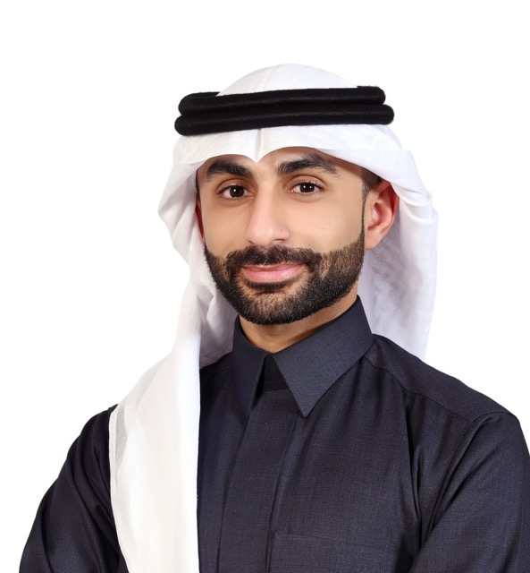

---
hide:
  - navigation
---

## About me

{ .profile-pic }

Assistant Professor, Mechanical Engineering Department
King Fahd University of Petroleum & Minerals (KFUPM)
Affiliated with the Interdisciplinary Research Center of Intelligent Manufacturing and Robotics (IRC-Manufacturing)

I lead a research group working at the intersection of smart structures, piezoelectricity, structural dynamics, metamaterials, energy harvesting, and wave manipulation. Our work combines analytical modeling, finite-element simulation, experiments, and programmable synthetic-impedance circuits to study tunable and multifunctional piezoelectric metastructures.

[:fontawesome-brands-google-scholar:](https://scholar.google.com/citations?user=j0fzfS4AAAAJ&hl=en){.social-icon} &nbsp;&nbsp;
[:fontawesome-brands-square-linkedin:](https://www.linkedin.com/in/malshaqaq/){.social-icon}

## Education

**Georgia Institute of Technology.**{.gatech-style} Atlanta, GA. 

-   (2020-2023) *__Ph.D.__ in Mechanical Engineering*.
    - Focus: Acoustic and Vibraitons.
    -   Minor: Applied Mathematics.
    - Dissertation: Programmable Piezoelectric Metamaterials Leveraging Synthetic Impedance Circuits.

-   (2020-2023) *__M.Sc.__ in Mechanical Engineering.*

**King Fahd University of Petroleum & Minerals.**{.kfupm-style} Dhahran, Saudi Arabia. 

-   (2016-2018) *__M.Sc.__ in Mechanical Engineering*.
    -   Thesis: Vibration of Axially Moving Small-Size Beams under Variable Electrostatic Force

-   (2010-2015) *__B.Sc.__ in Mechanical Engineering.*

## Openings

**Ph.D. and M.S. opportunities**

Open to highly motivated Ph.D. and M.S. students interested in metamaterials, vibrations, piezoelectric systems, wave control, and intelligent structural systems. Students with strong backgrounds in mechanics, FEM, controls, programming, and experiments are especially encouraged to get in touch.

## Selected Publication

Go to [publications](research#publications) for a the full list of publications.

